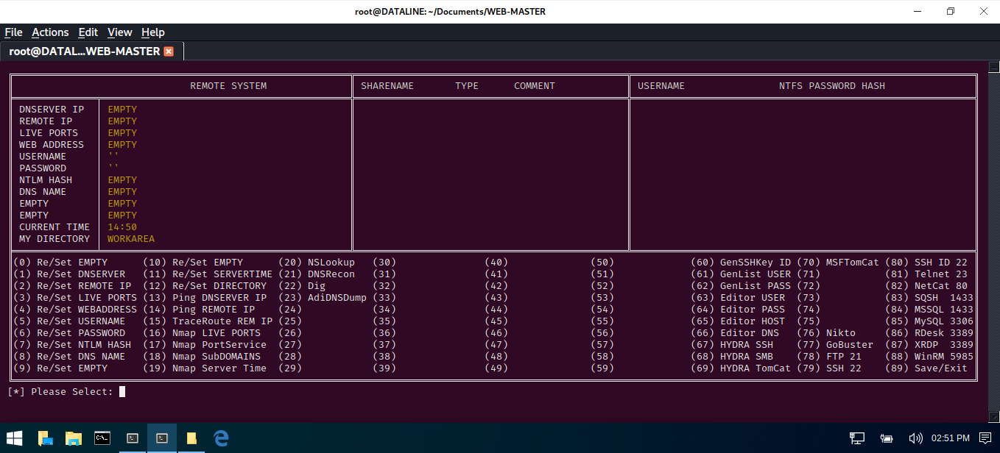

# WEB-MASTER
## A PYTHON SCRIPT FILE TO REMOTELY ANALYSE AND EXPLOIT WEB APPLICATIONS.

 

Usage: python3 WinMaster.py

| LANGUAGE  | FILENAME         | MD5 Hash                         | Version |
|------     |------            | -------                          | ----    |
| python3   | WebMaster.py     |                                  | Bank    |

A python script file to remotely exploit web applications - It can test ssls, sqlinjection, and so much more...

### CONSOLE DISPLAY
 

Found this project useful, or would like to see it amended in some way - make a donation.
https://paypal.me/TerenceBroadbent
